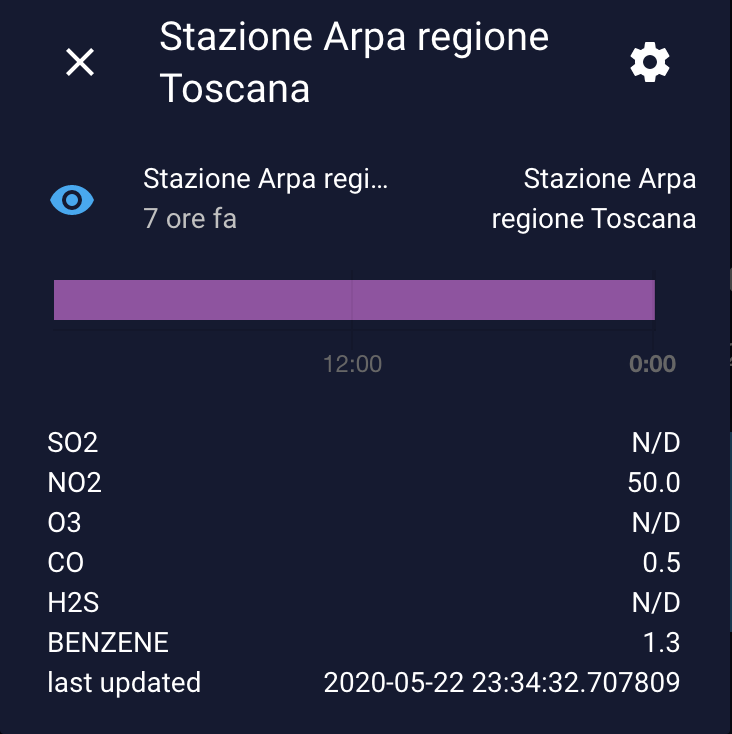
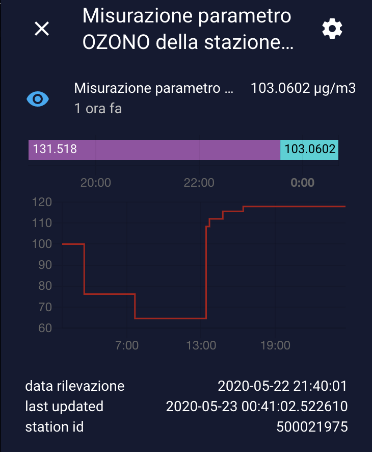
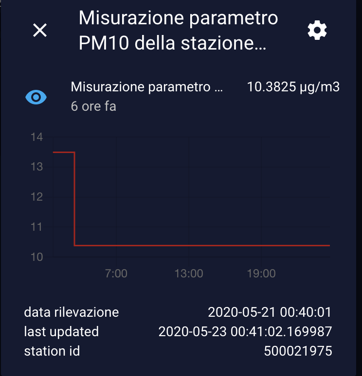

<a href="https://www.buymeacoffee.com/Gazzolinho" target="_blank"></a>

### [Support my work with a donation](https://paypal.me/marcogazzola)

    


 

# Arpa Air Quality
Get air information from Arpa
# <span style="font-family: 'Segoe UI Emoji'">🌬</span> Arpa Air quality

[](https://github.com/custom-components/hacs)

Collect information about Air quality information provided by Arpa Stations throught sensor.
Informations data are provided from Arpa local departments through [Open Data](https://www.agid.gov.it/it/dati/open-data).

## Guides and info
* [Configured regions](#configured-regions)
* [Installation](#Installation)
* [Configuration](#Configuration)
* [Sensor](#Sensor)
* [Parameter Sensor](#Parameter-Sensor)
* [Event](#Event)
* [Configuration](#Configuration)
* [Upgrade from 0.5.*](#Upgrade-from-0.5.*)

## Configured regions
|Region|Local Arpa site url|OpenData Url|
|---|---|---|
|`veneto`|https://www.arpa.veneto.it/|`http://213.217.132.81/aria-json/exported/aria/data.json`|
|`toscana`|http://www.arpat.toscana.it/|`http://www.arpat.toscana.it/temi-ambientali/aria/`|


## Installation
Use [HACS](https://github.com/custom-components/hacs) or [download](https://github.com/marcogazzola/hassio-arpa-air-quality/releases/latest) the `hassio-arpa-air-quality` directory inside the `apps` directory here to your local `apps` directory.

## Installation
Use [HACS](https://github.com/custom-components/hacs) or [download](https://github.com/marcogazzola/hassio-arpa-air-quality/releases/latest) the `hassio-arpa-air-quality` directory inside the `apps` directory here to your local `apps` directory.

**Remember to configure it after install**

## Configuration

In app/hassio-arpa-air-quality should be region.json file that contains all configuration setting.

|Parameter|Description|Type|Example|
|---|---|---|---|
|`regions`| Specific configuration of each region| `dictionary` of [`region_object`](#region-object)| `"regions": {"veneto": {"url": "http://213.217.132.81/aria-json/exported/aria/data.json", "station_id": "500021975", "monitored_params": ["pm10", "OZONO"]} }`|
|`unit_of_measurement`| Unit of measurement to apply to relative parameter| `dict`| `{"ozono": "µg/m3", "pm10": "µg/m3", "SO2": "µg/m3"}`|
|`refresh_rate`| Time to refresh in minutes| `int`| 30|
|`create_sensor`| Create a sensor for each monitored params of each configured region| `bool`| True|

### Region Object
**The configurable regions are [these](#configured-regions).**
|Parameter|Description|Type|Example|
|---|---|---|---|
|`url`| Url address of [Open Data](https://www.agid.gov.it/it/dati/open-data) json data| string| `http://213.217.132.81/aria-json/exported/aria/data.json`|
|`station_id`| Arpa monitored station | `string`| `500021975` or `FI-GRAMSCI`|
|`monitored_params`| Dictionary of units of measurement| `dictionary`| `{"ozono": "µg/m3", "pm10": "µg/m3", "SO2": "µg/m3" }`|

Example of region.json
> ```json
> {
>   "refresh_rate": 6,
>   "create_sensor": true,
>   "unit_of_measurement": {
>     "ozono": "µg/m3",
>     "pm10": "µg/m3",
>     "SO2": "µg/m3"
>   },
>   "regions": {
>     "veneto": {
>       "url": "http://213.217.132.81/aria-json/exported/aria/data.json",
>       "station_id": "500021975",
>       "monitored_params": [
>         "pm10",
>         "OZONO"
>       ]
>     },
>     "toscana": {
>       "url": "http://www.arpat.toscana.it/temi-ambientali/aria/> qualita-aria/dati_orari_real_time/json_orari_nrt/",
>       "monitored_params": ["SO2", "NO2", "O3", "CO", "H2S", "BENZENE"],
>       "station_id": "FI-GRAMSCI"
>     }
>   }
> }
>
> ```

## Sensor
At least one sensor per configured area will be created automatically
**sensor.arpa_air_station_<<<region_name>>**

> examplex: for toscana, sensors will be **sensor.arpa_air_station_toscana**



## Parameter Sensor

if [`create_sensor`](#Configuration) flag is True, will be automatically create sensor for each [`monitored_param`](#Configuration) configured.

The name of sensor is: **sensor.arpa_air_station_<<<region_name>>_<<parameter_name>>**

> example: for `SO2` in toscana, sensor name will be **sensor.arpa_air_station_toscana_so2**

Each sensor shows:
* State
  * Value and unit of measurement
* Attribues
  * Measurement_date: measurement date
  * Last_update: last refresh date
  * station_id: configured Arpa station




## Event
With a custom event **arpa_air_quality_refresh** it's possible to refresh data immediately.
Event has one mandatory parameter:

| Parameter| Description| Type| Example|
| --- | --- | ---  | --- |
| `regions`| List of regions to refresh| `list` | `regions:`</br>`  - toscana`</br> `  - veneto`|

> ```yaml
> # Example refresh Arpa air quality at sunrise both veneto and toscana
> - alias: Refresh Arpa air quality at sunrise both veneto and toscana
>   trigger:
>     - platform: sun
>       event: sunrise
>   action:
>     - event: arpa_air_quality_refresh
>       event_data:
>         regions: 
>           - veneto
>           - toscana
>
>
> # Example refresh Arpa air quality at sunset only for veneto
> - alias: Refresh Arpa air quality at sunset only for veneto
>   trigger:
>     - platform: sun
>       event: sunset
>   action:
>     - event: arpa_air_quality_refresh
>       event_data:
>         regions: 
>           - veneto
> ```

## Upgrade from 0.5.*
After update from version 0.5.* to >1.0.0 you can delete old keys in secrets.yaml file and sensors in configuration.yaml file.
Items to remove are:
- **secrets.yaml**
  - arpa_url_json
  - arpa_station_id
  - arpa_refresh_rate
  - arpa_monitored_params
- **configuration.yaml** (template sensors)
  - arpa_url_json
  - arpa_station_id
  - arpa_refresh_rate
