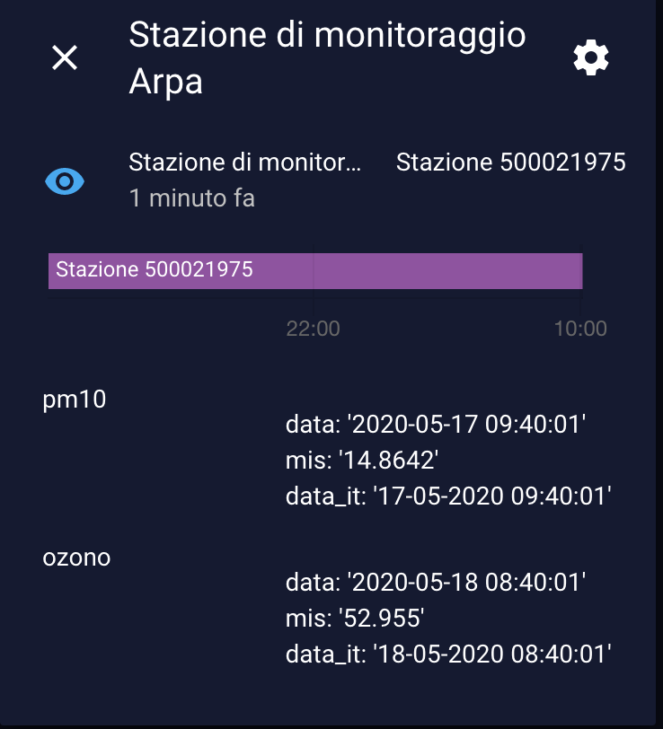

<a href="https://www.buymeacoffee.com/Gazzolinho" target="_blank"></a>

### [Support my work with a donation](https://paypal.me/marcogazzola)

    


 

# Arpa Air Quality
Get air information from Arpa (https://www.arpa.veneto.it/)
# <span style="font-family: 'Segoe UI Emoji'">🌬</span> Arpa Veneto Air quality

[](https://github.com/custom-components/hacs)

Collect information about Air quality information provided by Arpa Veneto throught sensor

## Installation
Use [HACS](https://github.com/custom-components/hacs) or [download](https://github.com/marcogazzola/hassio-arpa-air-quality) the `arpa_air_quality` directory from inside the `apps` directory here to your local `apps` directory.

## Configuration

Just add these key to your secrets.yaml file:
- arpa_url_json
- arpa_station_id
- arpa_refresh_rate
- arpa_monitored_params

| Parameter                       | Description                              | Type     | Example                                     |
| ------------------------------- | ---------------------------------------- | ------   | ------------------------------------------- |
| [`arpa_url_json`](#)            | Url of Json data                         | `string` | http://213.217.132.81/aria-json/exported/aria/data.json      |
| [`arpa_station_id`](#)          | Station ID to fetch data.                | `integer`| 500021975         |
| [`arpa_refresh_rate`](#)        | Refresh rate in hour. Default 6 hours    | `integer`| 6                 |
| [`arpa_monitored_params`](#)    | List of params to monitor                | `list`   | - ozono</br>- pm10|


> ```yaml
> # Example secrets.yaml entry
> arpa_url_json: http://213.217.132.81/aria-json/exported/aria/data.json
> arpa_station_id: 500021975
> arpa_refresh_rate: 6
> arpa_monitored_params:
>   - ozono
>   - pm10
> ```

Just add sensors to your configuration.yaml file. 
```
sensor:
- platform: template
  sensors:
    arpa_url_json: 
      value_template: !secret arpa_url_json
    arpa_station_id: 
      value_template: !secret arpa_station_id
    arpa_refresh_rate: 
      value_template: !secret arpa_refresh_rate
```

## Sensor
Automatically will be created sensor **sensor.arpa_air_station**



## Event
With a custom event **arpa_air_quality** it's possible to refresh data immediately.
Event can accept optional parameters:

| Parameter                       | Description                              | Type     | Example                                     |
| ------------------------------- | ---------------------------------------- | ------   | ------------------------------------------- |
| [`arpa_url_json`](#)            | Url of Json data                         | `string` | http://213.217.132.81/aria-json/exported/aria/data.json      |
| [`arpa_station_id`](#)          | Station ID to fetch data.                | `integer`| 500021975         |
| [`arpa_monitored_params`](#)    | List of params to monitor                | `list`   | - ozono</br>- pm10|


> ```yaml
> # Example refresh Arpa air quality at sunset and monitor only pm10
> - alias: Refresh Arpa air quality at sunset and monitor only pm10
>   trigger:
>     - platform: sun
>       event: sunset
>   action:
>     - event: arpa_air_quality
>       event_data:
>         arpa_monitored_params: 
>           - pm10
> ```